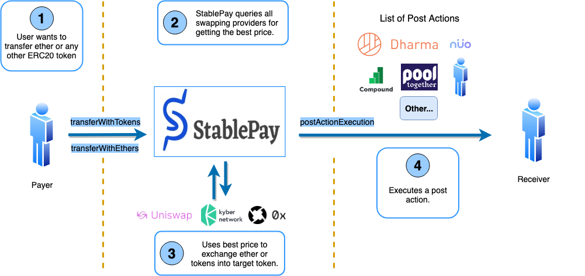
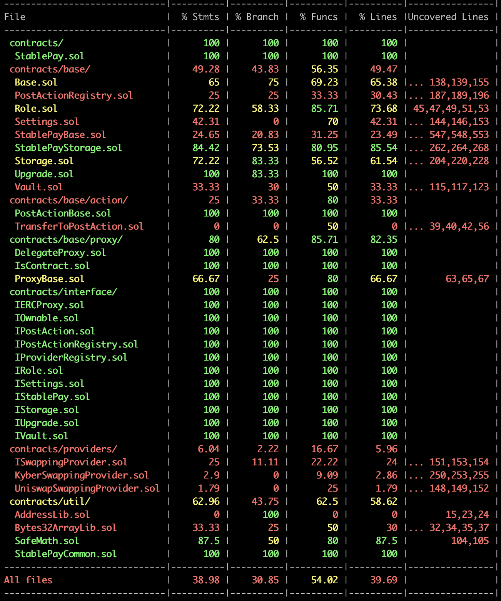

[](https://stablepay.io)

---
## Description

Official [StablePay](https://stablepay.io) smart contracts repository.

[](https://circleci.com/gh/StablePay/stablepay_contracts_dev)

## What is StablePay?

[StablePay](https://stablepay.io) is a decentralized platform for the new internet of money. [StablePay](https://stablepay.io) allows people to send any ERC20 token or ether and receive any ERC20 token or ether in a secured and easy way.

> StablePay was one of the **bounty prize winners** in ETHSanFrancisco 2018.

To see more information, please visit:

* [StablePay](https://stablepay.io) website.
* Post in [ETH San Francisco Hackathon 2018](https://devpost.com/software/stablepay).

## Architecture Diagram



---

## External References

Some useful external links related to the platform.

* [Eternal Storage](https://fravoll.github.io/solidity-patterns/eternal_storage.html)
* [Proxy Delegate Call](https://fravoll.github.io/solidity-patterns/proxy_delegate.html)
* [Kyber Network](https://kyber.network/)
* [Uniswap](https://uniswap.io/)
* [Uniswap Explained](https://medium.com/@mika_49129/uniswap-and-value-capture-in-decentralised-exchange-protocols-b8df056eb95e)

## Project Structure

```bash
├── .circleci
│     Circle CI configuration.
├── config
│       Configuration for each network.
├── contracts
│     ├── base
│     │     All the smart contracts for base architecture.
│     ├── interface
│     │     Abstractions for most of the base smart contracts.
│     ├── mock
│     │     All the mock smart contracts for testing purposes.
│     ├── providers
│     │     All the current swapping providers implemented in the platform.
│     ├── services
│     │     External smart contracts (interfaces) used in the platform.
│     └── util
│           Libraries used in the platform.
├── docs
├── migrations
│     Migration scripts for deployment.
├── resources
│     Resources used in the platform. E.g.: Ganache snapshot integrated with StablePay and KyberNetwork.
├── scripts
│     Truffle scripts used to execute specific actions.
├── src
│     JS code needed for testing purposes and the deployment process.
├── test
│     All unit tests of the platform.
├── test-integration
│     All integration tests of the platform. These tests are executed in Ropsten.
└── .gitignore
```

---

## Get Started

### Pre-requirements

In the development phase the following tool versions were used:

* NPM: 5.4.1
* NodeJS: 10.15.3
* Truffle: 10.0.26

### Checkout the repository

```sh
$ git clone https://github.com/StablePay/stablepay_contracts_dev.git
```

### Install dependencies

```sh
$ npm install
```
and install Truffle globally executing the npm command below:
```sh
$ npm install truffle -g
```

### Setup Environment Variables

The platform needs some env variables to be configured properly. In order to configure them, create a `.env` file based on the `.env.template` file.

Then follow the instructions in the .env to setup the correct values before executing any command.

#### Infura

The **INFURA_KEY** key is needed to execute smart contracts in a testnet or mainnet. To get a key, just visit *https://infura.net*, and signup.

> This configuration value is not required to run the unit tests.

#### Mnemonic

 The **MNEMONIC_KEY** key is used to get/create the ethereum addresses.

#### Platform Fee

The **PLATFORM_FEE** is used to calculate the fee amount in each transaction in the smart contract execution. By default it is 1% (the platform fee value is multiplied by 100. So 2% is 200). **So, it is not required to modify the default value.**

#### Kyber Address Fee

The **KYBER_ADDRESS_FEE** is used to get a fee from Kyber Network when a swap is executed using Kyber Network

> This configuration value is not required to run the unit tests.

### Run tests

After configuring the environment variables, the tests can be executed.

#### Unit Tests

```sh
$ truffle test
```

#### Integration Tests

The platform contains integration tests to run in the Ropsten network.

They can be executed using the command below:

```truffle test ./test-integration/test-name.js --network infuraRopsten```

#### Code Coverage

The code coverage process can be executed using the command below:

```npm run test:coverage```

At the end of the process, a result will display in the command line as below:



#### Scripts

We have developed some scripts to make some actions easily.

An script can be executed using the command below:

```truffle exec ./scripts/script-name.js --network infuraRopsten```

> Note: Some scripts requires admin privilegies. Please, check your configured mnemonic value.

#### Prettier Lint Plugin

The project uses the [prettier solidity plugin](https://github.com/prettier-solidity/prettier-plugin-solidity).

---

## External Smart Contracts

We copied some external contracts into this repository due to they were in a NPM dependency:

* SimpleToken.sol. See [hash commit version](https://github.com/OpenZeppelin/openzeppelin-contracts/commit/d1158ea68c597075a5aec4a77a9c16f061beffd3).

- 

---
## Contact Us

If you have any question or feedback, contact us at hi@stablepay.io.
